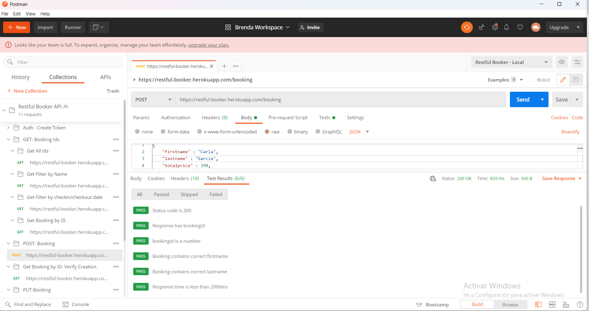
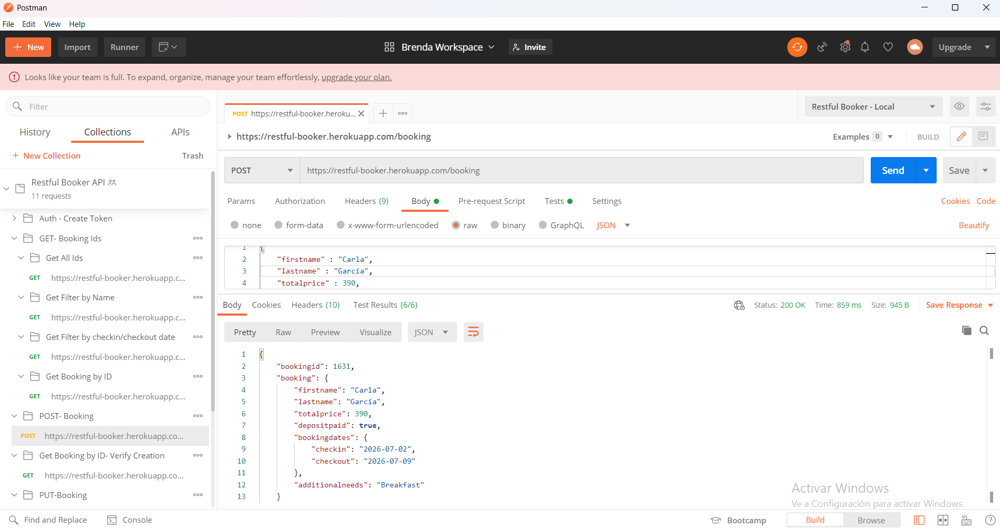
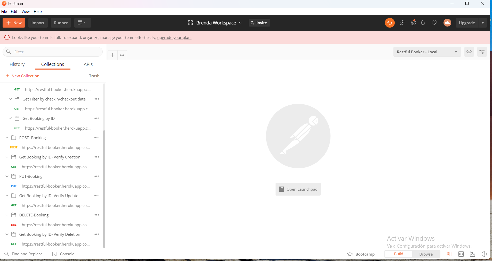
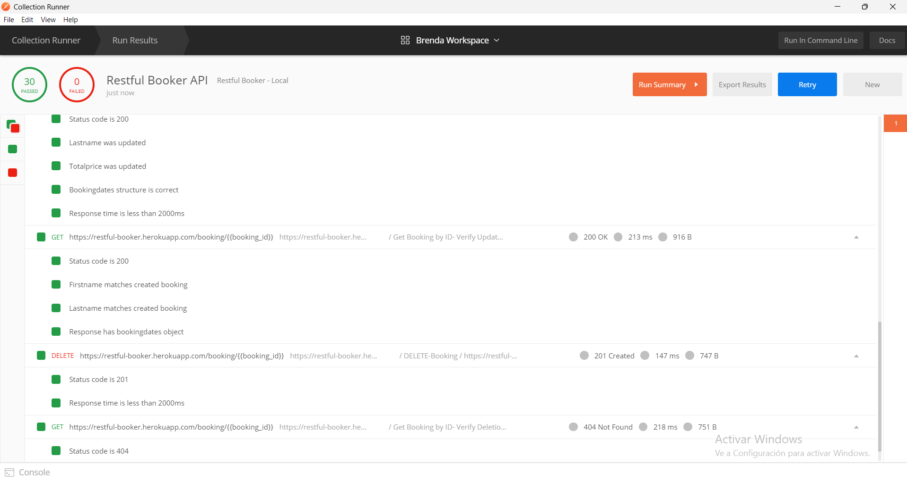

# Restful Booker API – Postman Testing

A Postman collection built to practice and demonstrate API testing skills using the [Restful Booker](https://restful-booker.herokuapp.com/apidoc/index.html) playground API.

## What this covers

- Full CRUD operations (GET, POST, PUT, DELETE) on the `/booking` endpoint
- Token-based authentication via `/auth`
- Automated tests validating status codes, response structure, and data integrity
- End-to-end verification flow: create → verify creation → update → verify update → delete → verify deletion
- Environment variables used to pass data between requests (`auth_token`, `booking_id`)

## Test flow

1. **Auth** – generates the authentication token required for PUT and DELETE requests
2. **Post Booking** – creates a new booking and stores its ID
3. **Get by ID (Verify Creation)** – confirms the booking was created with the correct data
4. **Put Booking** – updates the booking (requires authentication)
5. **Get by ID (Verify Update)** – confirms the update was applied correctly
6. **Delete Booking** – deletes the booking (requires authentication)
7. **Get by ID (Verify Deletion)** – confirms the booking no longer exists (expects 404)

Additional requests: filtering bookings by name and by check-in/check-out dates.

## Tools used

- Postman (collections, environments, automated tests)
- Restful Booker API (public playground API for practicing API testing)

## How to run it

1. Import `Restful-Booker-API.postman_collection.json` into Postman
2. Create an environment with variables `auth_token` and `booking_id` (empty values, they populate automatically)
3. Run the collection in order using the Collection Runner

## Screenshots

### Individual test results

### Collection structure

### Collection Runner summary

